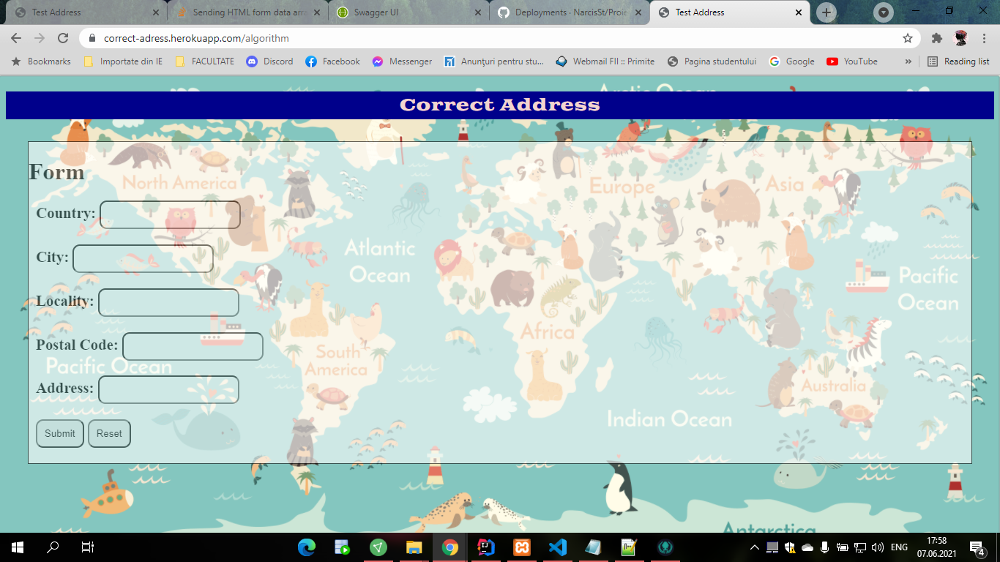
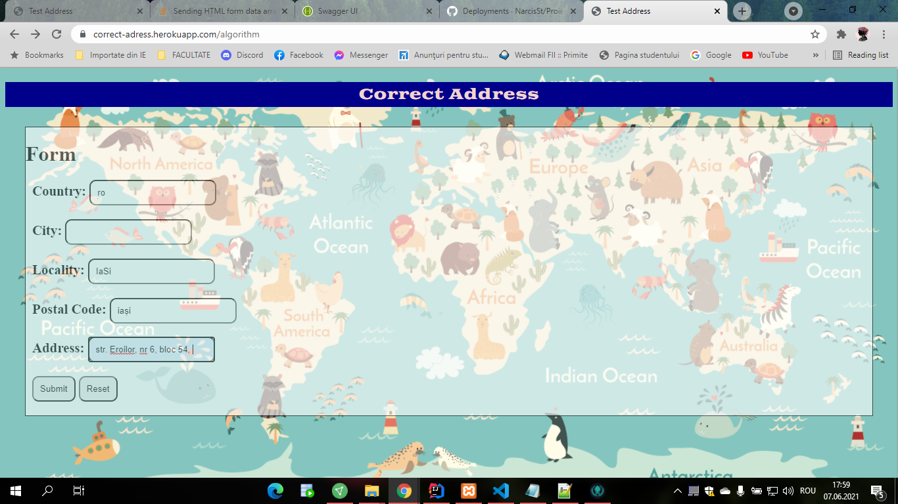
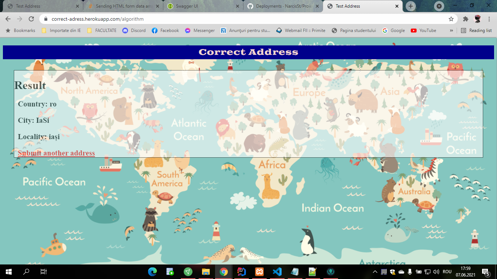

# Proiect Programare Avansata 2021

Autori:  Maria Gabriela Coteanu 

### Cerinta:

#### Correct an address
- Write an algorithm that corrects the fields country, state, city of a postal
  address. Example: Country: RO, State: New York, City: Iasi will become
  Country: RO, State: Iasi, City: Iasi
- the algorithm needs to have unit tests and integration tests for performance
  and precision
- ideally the algorithm will work for all countries in the world and a few
  languages
- Expose a REST api using spring boot that will receive a postal address and
  return the corrected result
- Deploy the application as a docker container in aws/heroku or other using a
  continuous deployment pipeline

#### Pentru a rula aplicatia local, trebuie rulat serverul, si deschis portul dat in orice browser.

##### De asemenea, aplicatia este si incarcata in cloud, la adresa: https://correct-adress.herokuapp.com.

##### Linkul catre documentatia generata cu swagger: http://localhost:8081/swagger-ui.html

##### In fiserul "app.log" din directorul "logs" sunt pastrate rezultatele tuturor rularilor.

### Snippets

### OBS: 
In this project I worked in pair with Narcis Stefan Barat, but he made only the deployment, but for this repository, I made it myself.